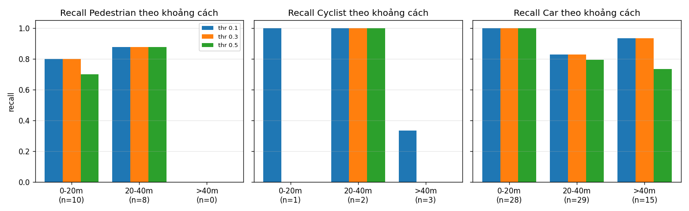

# Báo cáo Day 6: PointPillars trên KITTI mini — recall theo khoảng cách và latency

> Thay **mọi** ô có chữ ĐIỀN nằm trong ngoặc vuông bằng nội dung của bạn, xoá luôn cả dấu ngoặc vuông. Lệnh `python tools/check_submission.py` sẽ báo FAIL nếu còn sót bất kỳ chỗ nào.

- **Họ tên:** Bui Dinh De
- **MSSV:** 2A202602818
- **Lớp:** [H209-Track04]
- **Link repo:** https://github.com/buide03/K4-Track4-Day06-3D-From-Point-Clouds-BuiDinhDe-2A202602818
- **Topic:** B — Chạy baseline 3D detector (PointPillars KITTI-3class, MMDetection3D, checkpoint có sẵn)
- **Dataset:** data/kitti_mini
- **Các frame đã dùng:** cả 20 frame của kitti_mini: 000001, 000004, 000007, 000008, 000009, 000010, 000011, 000012, 000015, 000016, 000019, 000021, 000023, 000025, 000031, 000032, 000043, 000048, 000049, 000061

> Hãy viết ngắn: mỗi mục từ 3 đến 8 dòng, ưu tiên số liệu và hình ảnh.

## 1. Claim

Một câu khẳng định kỹ thuật có thể kiểm chứng. Ví dụ: *"Lệch yaw 1° làm 12% điểm LiDAR rơi ra khỏi vật thể ở 30 m, phát hiện được bằng edge-alignment score với ngưỡng X."*

**Claim:** Trên 20 frame kitti_mini, PointPillars KITTI-3class tăng `score_thr` từ 0.1 lên 0.5 làm precision tăng từ 0.47 lên 0.82 trong khi recall chỉ giảm từ 0.89 xuống 0.81; Cyclist là lớp chịu thiệt nhiều nhất (recall 0.67 → 0.33); latency p95 = 71 ms trên RTX 3050 Laptop.

*Cách đo:* GT được tính là "trúng" nếu có box dự đoán cùng lớp có tâm BEV cách tâm GT ≤ 2 m. Chỉ đánh giá 3 lớp model được train (Car, Pedestrian, Cyclist); box không ghép được chỉ tính FP khi nằm trong FOV camera (KITTI chỉ gán nhãn trong ảnh). Latency: bỏ lần chạy đầu, 30 lần mỗi frame, báo p50/p95.

*Claim nháp ở CP1* ("recall Car < 50 % ở > 40 m, Pedestrian thấp hơn Car ≥ 20 điểm %, p95 < 50 ms") **bị số liệu CP3 bác bỏ**: recall Car > 40 m = 0.93 (n = 15), Pedestrian 0.83 so với Car 0.92, p95 = 70.6 ms.

## 2. Evidence

Bảng hoặc plot số liệu, kèm ảnh/video demo. Ghi rõ đường dẫn file trong `results/`.

PointPillars KITTI-3class, 20 frame kitti_mini, 96 GT (Car 72 · Ped 18 · Cyc 6). Chỉ đổi `score_thr`; ghép cùng lớp, tâm BEV ≤ 2 m (`results/score_thr_sweep.csv`, `results/recall_by_class_range.csv`).

| score_thr | Box/frame (trong FOV) | TP / FP / FN | Recall | Precision | Recall Car · Ped · Cyc | Recall Car > 40 m (n=15) |
|---|---|---|---|---|---|---|
| 0.1 | 8.95 | 85 / 95 / 11 | 0.885 | 0.472 | 0.917 · 0.833 · 0.667 | 0.933 |
| 0.3 | 6.75 | 83 / 53 / 13 | 0.865 | 0.610 | 0.917 · 0.833 · 0.333 | 0.933 |
| 0.5 | 4.60 | 78 / 17 / 18 | 0.812 | 0.821 | 0.861 · 0.778 · 0.333 | 0.733 |

Latency (`results/latency.csv`, NVIDIA GeForce RTX 3050 Laptop GPU, AMD Ryzen 7 5800H, torch 2.1.2+cu118; bỏ 1 lần chạy đầu): cùng frame 000011, 30 lần → **p50 60.7 ms, p95 70.6 ms**; 20 frame × 30 lần → p50 63.5 ms, p95 68.8 ms. Pass/fail từng frame @ 0.3 (đủ GT, không FP): 4/20 (`results/per_frame_pass_fail_thr0.3.csv`).





## 3. Failure case

Nêu khi nào hệ thống hoặc phương pháp fail, vì sao fail, và liên hệ tới lớp nào trong 6 lớp debug: I/O, Geometry, Time, Preprocess, Model, Metric.

**Fail 01 — xe bị che khuất bị bỏ sót (lớp Model, gốc ở Sensor/Data).** Frame 000049 @ `score_thr` 0.3: 5/16 GT bị bỏ sót, cả 5 là Car ở 22–33 m, đậu chéo phía sau xe gần và thân cây, `occluded` = 2–3, chỉ 20–140 điểm LiDAR; không có box nào (kể cả score 0.1) trong bán kính 4 m. Trên cả 20 frame (`results/failure_recall_by_occlusion.csv`, `..._by_points.csv`): recall 64/68 = 0.94 với vật không/ít bị che (occluded 0–1) nhưng chỉ 13/18 = 0.72 với occluded = 2; theo số điểm: < 50 điểm → 0.79, ≥ 200 điểm → 0.95.


*Vì sao:* LiDAR chỉ thấy theo đường thẳng, vật phía sau bị "bóng" của vật trước che → còn vài hàng điểm của nóc/đuôi xe. PointPillars gom điểm thành pillar 16 cm rồi dự đoán bằng anchor; mẫu xe thiếu nửa thân, ít điểm, nằm chéo nhiều khả năng khác xa phần lớn mẫu xe lúc train → score của mọi box ở đó đều dưới ngưỡng 0.1 trong config (đã kiểm: không có box nào trong 4 m). *Phát hiện khi chạy thật:* (1) tracker giữ track của xe đang bị che thay vì xoá ngay khi detector mất box; (2) vùng "bóng" LiDAR trên BEV đánh dấu là *chưa biết* chứ không phải *trống*; (3) so với detector 2D trên camera (camera vẫn thấy các xe này) và log các trường hợp camera thấy mà LiDAR không.

**Fail 02 — lỗi cách đo của chính bài làm (lớp Metric).** Bản đầu của `src/benchmark.py` bỏ box dự đoán có tâm ngoài FOV camera *trước khi* ghép. Xe Car 6.8 m ở frame 000011 bị cắt mép ảnh (`truncated` = 0.98): model đoán đúng (score 0.95, lệch tâm 0.07 m) nhưng tâm box nằm ngoài FOV → bị tính là bỏ sót. Recall Car 0–20 m bị báo 25/28 = 0.89 thay vì 28/28 = 1.00 (`results/failure_fov_filter.csv`). Đã sửa: ghép với mọi box, FOV chỉ dùng để quyết định có tính FP hay không. *Phòng tránh:* luôn chạy kiểm tra "dùng GT làm dự đoán phải ra recall 1.0" và xem tay các GT bị đánh dấu bỏ sót trước khi tin vào metric.


## 4. Khuyến nghị nếu triển khai thật

Use-case cụ thể (ADAS / robot / drone), trade-off và bước tiếp theo.

**Use-case:** phát hiện xe/người/xe đạp phía trước cho ADAS trong đô thị (phanh khẩn cấp, giữ làn có xe đỗ hai bên như KITTI).

- **Ngưỡng score:** 0.1 cho recall 0.885 nhưng precision 0.47 (95 FP/20 frame → nguy cơ phanh ảo); 0.5 còn 17 FP nhưng recall 0.812 và Cyclist chỉ 0.33. Khuyến nghị 0.3 (recall 0.865, precision 0.61) **kèm tracking** xác nhận qua 2–3 frame để lọc FP, và hạ ngưỡng ở vùng gần (< 20 m) cho Pedestrian/Cyclist vì bỏ sót người nguy hiểm hơn phanh nhầm.
- **Tốc độ:** p95 = 70.6 ms trên RTX 3050 Laptop (≈ 14 FPS) — kịp LiDAR 10 Hz nhưng chỉ còn ~30 ms cho tracking/planning. Trên máy nhúng (Jetson…) chưa đo; cần benchmark lại hoặc dùng TensorRT/FP16 trước khi tin là realtime.
- **Vùng phủ:** `point_cloud_range` chỉ 0–69 m phía trước, ±39.7 m ngang → không thấy phía sau và hai bên sát xe; cần model 360° hoặc cảm biến khác cho chuyển làn/lùi.
- **Che khuất (fail_01):** recall 0.72 với vật bị che phần lớn → giữ track khi vật bị che, đánh dấu vùng bóng LiDAR là "chưa biết", kết hợp camera.
- **Chỉ số cần log khi chạy thật:** latency p50/p95/max mỗi phút; số điểm LiDAR/frame và số điểm trong mỗi box dự đoán; số box và phân bố score theo lớp (phát hiện drift); số track bị mất khi đang bị che; số lần camera thấy vật mà LiDAR không; độ lệch timestamp LiDAR–camera.
- **Bước tiếp theo:** so sánh với SECOND/CenterPoint trên cùng 20 frame (độ chính xác vs latency), và chạy lại trên nuScenes 32-beam (thưa hơn ~3 lần) để xem recall theo số điểm có giảm như dự đoán không.

## 5. Cách chạy lại

Các lệnh tái tạo lại toàn bộ kết quả từ repo sạch.

```bash
# Môi trường chính (Python >= 3.10)
python -m venv .venv && source .venv/bin/activate
pip install -r requirements.txt

# CP2 — kiểm tra phép chiếu LiDAR -> ảnh (ảnh lưu ở results/figures/overlay_*.png)
python -m starter.projection --data-root data/synthetic --frame 000000
python -m starter.projection --data-root data/kitti_mini --frame 000011
python -m starter.projection --data-root data/nuscenes_mini_subset --frame scene-0103_010

# Môi trường detector (Python 3.10, GPU NVIDIA): torch 2.1.2+cu118, mmcv 2.1.0, mmdet 3.2.0, mmdet3d 1.4.0
uv venv --python 3.10 .venv-det
uv pip install --python .venv-det/bin/python torch==2.1.2 torchvision==0.16.2 --index-url https://download.pytorch.org/whl/cu118
uv pip install --python .venv-det/bin/python "numpy<2" mmengine==0.10.7 mmcv==2.1.0 mmdet==3.2.0 mmdet3d==1.4.0 \
  --find-links https://download.openmmlab.com/mmcv/dist/cu118/torch2.1.0/index.html
wget -P checkpoints https://download.openmmlab.com/mmdetection3d/v1.0.0_models/pointpillars/hv_pointpillars_secfpn_6x8_160e_kitti-3d-3class/hv_pointpillars_secfpn_6x8_160e_kitti-3d-3class_20220301_150306-37dc2420.pth

# CP2 — baseline PointPillars trên 20 frame kitti_mini -> results/preds_kitti.json + results/figures/bev/bev_*.png
.venv-det/bin/python -m src.infer --data-root data/kitti_mini

# CP3 — sweep score_thr 0.1/0.3/0.5 (đọc preds_kitti.json, không chạy lại model; kết quả lặp lại y hệt)
.venv-det/bin/python -m src.benchmark
# CP3 — latency p50/p95 (cần GPU; số ms dao động nhẹ giữa các lần chạy)
.venv-det/bin/python -m src.latency

# CP4 — failure: recall theo mức che khuất / số điểm, ảnh fail_01, fail_02
.venv-det/bin/python -m src.failure
```

## 6. Khai báo sử dụng AI

Ghi rõ đã dùng công cụ AI nào, dùng vào việc gì, và bạn đã tự kiểm chứng kết quả đó bằng cách nào. Nếu không dùng AI, ghi "Không sử dụng". Xem quy định ở `RULES.md` mục 2.

| Công cụ | Dùng cho việc gì | Bạn đã kiểm chứng thế nào |
|---|---|---|
| Claude Code (Claude Opus 5.5) | Đọc tài liệu lab, lập kế hoạch theo checkpoint, viết `CLAUDE.md` | Đối chiếu với README/CHECKPOINTS/RUBRIC gốc |
| Claude Code | Cài môi trường detector (torch 2.1.2+cu118, mmcv 2.1.0, mmdet3d 1.4.0), tải checkpoint PointPillars | `torch.cuda.is_available()` = True trên RTX 3050; chạy thử 1 frame, box khớp GT trên ảnh BEV |
| Claude Code | Viết 2 hàm TODO trong `starter/projection.py` | Điểm (10,0,0) → z_cam 9.73, (u,v) = (614, 175) như CHECKPOINTS; NaN và điểm sau camera bị loại; overlay 3 dataset; % điểm box 3D rơi vào box 2D = 99.6 % (KITTI 000011), giảm còn 53.7 % khi lệch yaw 2° |
| Claude Code | Viết `src/boxes.py`, `src/infer.py`, `src/benchmark.py`, `src/latency.py`, `src/failure.py` | 8 góc box đổi hệ khớp trong 2–4 cm; box GT chứa điểm LiDAR; xem tay ảnh BEV; chạy lại benchmark/failure ra CSV trùng MD5; xem tay từng GT bị bỏ sót → phát hiện và sửa lỗi lọc FOV (fail_02) |
| Claude Code | Soạn nội dung REPORT (claim, evidence, failure, khuyến nghị) | Mọi con số đối chiếu với file CSV trong `results/`; claim nháp bị số liệu bác bỏ nên đã viết lại theo số đo |
