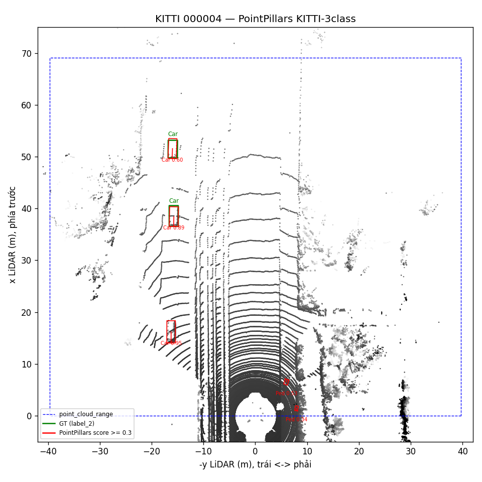
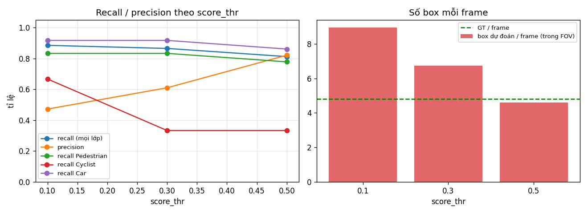
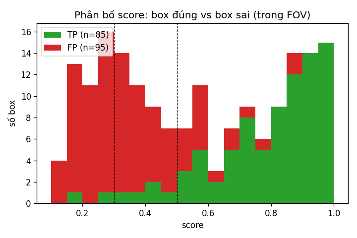
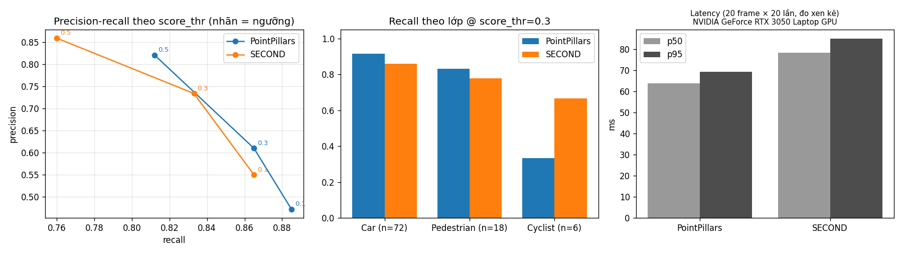
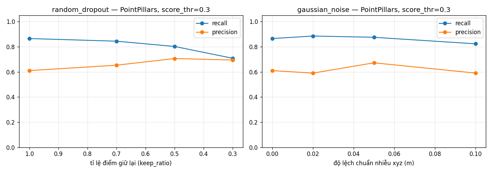
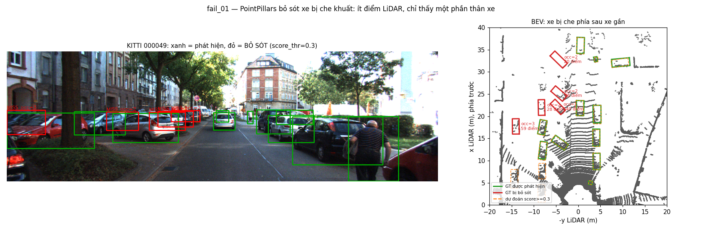
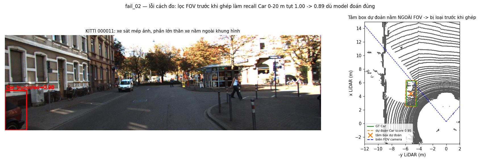

# Báo cáo Day 6: PointPillars trên KITTI mini — ngưỡng score, latency và failure

- **Họ tên:** Bui Dinh De
- **MSSV:** 2A202602818
- **Lớp:** [H209-Track04]
- **Link repo:** https://github.com/buide03/K4-Track4-Day06-3D-From-Point-Clouds-BuiDinhDe-2A202602818
- **Topic:** B — Chạy baseline 3D detector (PointPillars KITTI-3class, MMDetection3D, checkpoint có sẵn)
- **Dataset:** data/kitti_mini
- **Các frame đã dùng:** cả 20 frame của kitti_mini: 000001, 000004, 000007, 000008, 000009, 000010, 000011, 000012, 000015, 000016, 000019, 000021, 000023, 000025, 000031, 000032, 000043, 000048, 000049, 000061

## 1. Claim

**Claim:** Trên 20 frame kitti_mini, PointPillars KITTI-3class tăng `score_thr` từ 0.1 lên 0.5 làm precision tăng từ 0.47 lên 0.82 trong khi recall chỉ giảm từ 0.89 xuống 0.81; Cyclist là lớp chịu thiệt nhiều nhất (recall 0.67 → 0.33); latency p95 = 71 ms trên RTX 3050 Laptop.

*Cách đo:* GT "trúng" khi có box cùng lớp, tâm BEV cách ≤ 2 m; chỉ xét Car/Pedestrian/Cyclist; box thừa chỉ tính FP nếu nằm trong FOV camera (KITTI chỉ gán nhãn trong ảnh). Claim nháp ở CP1 (recall Car > 40 m < 50 %, p95 < 50 ms) bị số liệu bác bỏ: thực tế 0.93 và 70.6 ms.

## 2. Evidence

96 GT (Car 72 · Ped 18 · Cyc 6); chỉ đổi `score_thr` (`results/score_thr_sweep.csv`, `recall_by_class_range.csv`).

| score_thr | TP / FP / FN | Recall | Precision | Recall Car · Ped · Cyc |
|---|---|---|---|---|
| 0.1 | 85 / 95 / 11 | 0.885 | 0.472 | 0.917 · 0.833 · 0.667 |
| 0.3 | 83 / 53 / 13 | 0.865 | 0.610 | 0.917 · 0.833 · 0.333 |
| 0.5 | 78 / 17 / 18 | 0.812 | 0.821 | 0.861 · 0.778 · 0.333 |

Latency (`results/latency.csv`, RTX 3050 Laptop, Ryzen 7 5800H, bỏ lần chạy đầu): frame 000011 × 30 lần → **p50 60.7 ms, p95 70.6 ms**; 20 frame × 30 lần → p50 63.5 / p95 68.8 ms. Box sai tập trung ở score < 0.5 (histogram). Thêm: `recall_by_range.png`, `per_frame_pass_fail_thr0.3.csv`.





**Bonus B1 — PointPillars vs SECOND** (`score_thr` 0.3, latency đo xen kẽ 2 model, 20 frame × 20 lần; `results/model_comparison*.csv`)

| Model | Recall | Precision | FP | Cyclist | Car > 40 m | Bị che (occ 2) | p50 / p95 ms |
|---|---|---|---|---|---|---|---|
| PointPillars | 0.865 | 0.610 | 53 | 2/6 | 14/15 | 13/18 | 63.9 / 69.5 |
| SECOND | 0.833 | 0.734 | 29 | 4/6 | 10/15 | 10/18 | 78.5 / 85.1 |

SECOND (voxel 5 cm, sparse conv 3D) ít FP hơn, precision cao hơn ở cả 3 ngưỡng, nhưng chậm hơn ~23 % và bỏ sót nhiều xe xa / bị che hơn; PointPillars nhanh hơn, recall cao hơn nhưng nhiều FP. Cyclist chỉ 6 GT nên chênh lệch chưa đủ để kết luận.



**Bonus B2 — stress test** (PointPillars, `score_thr` 0.3, seed 0; `results/stress_test.csv`)

| Suy giảm | Mức | Recall | Precision |
|---|---|---|---|
| gốc | — | 0.865 | 0.610 |
| random_dropout (giữ lại) | 70 / 50 / 30 % | 0.844 / 0.802 / 0.708 | 0.653 / 0.706 / 0.694 |
| gaussian_noise (σ xyz) | 2 / 5 / 10 cm | 0.885 / 0.875 / 0.823 | 0.590 / 0.672 / 0.590 |

Mất điểm làm recall giảm đều (khớp fail_01); nhiễu ≤ 5 cm (nhỏ hơn pillar 16 cm) gần như không ảnh hưởng. Dao động nhỏ (±0.02 = 2 vật) do chỉ có 96 GT.



## 3. Failure case

**Fail 01 — xe bị che khuất bị bỏ sót (lớp Model, gốc ở cảm biến).** Frame 000049: 5/16 xe bị bỏ sót, đều ở 22–33 m, đậu chéo sau xe gần và thân cây, `occluded` 2–3, chỉ 20–140 điểm LiDAR, không có box nào trong 4 m kể cả ở score 0.1. Trên 20 frame: recall 0.94 với vật không/ít bị che nhưng 0.72 khi bị che phần lớn; < 50 điểm → 0.79, ≥ 200 điểm → 0.95 (`results/failure_recall_by_*.csv`). *Vì sao:* LiDAR bị vật phía trước che nên chỉ còn vài hàng điểm của nóc/đuôi xe; mẫu thiếu nửa thân như vậy nhiều khả năng khác xa mẫu lúc train nên không box nào vượt score 0.1. *Phát hiện khi chạy thật:* tracker giữ track của xe đang bị che, đánh dấu vùng bị che trên BEV là "chưa biết", log các lần camera thấy vật mà LiDAR không.



**Fail 02 — lỗi cách đo của chính bài (lớp Metric).** Bản đầu lọc box theo FOV camera *trước khi* ghép: xe 6.8 m ở frame 000011 bị cắt mép ảnh (`truncated` 0.98) được đoán đúng (score 0.95, lệch 0.07 m) nhưng tâm box ngoài FOV → bị tính bỏ sót; recall Car 0–20 m bị báo 0.89 thay vì 1.00 (`results/failure_fov_filter.csv`). Đã sửa: ghép với mọi box, FOV chỉ dùng khi đếm FP. *Phòng tránh:* xem tay các GT bị đánh dấu bỏ sót trước khi tin metric.



## 4. Khuyến nghị nếu triển khai thật

**Use-case:** ADAS đô thị phát hiện xe/người/xe đạp phía trước (phanh khẩn cấp, đường có xe đỗ hai bên).
- **Ngưỡng:** chọn 0.3 (recall 0.865, precision 0.61) kèm tracking xác nhận qua 2–3 frame; 0.1 có 95 FP → phanh ảo, 0.5 bỏ sót nhiều cyclist. Hạ ngưỡng ở vùng gần cho người đi bộ/xe đạp.
- **Tốc độ:** p95 70.6 ms (≈ 14 FPS) kịp LiDAR 10 Hz nhưng chỉ còn ~30 ms cho tracking/planning; chưa đo trên máy nhúng. SECOND chính xác hơn nhưng chậm hơn ~23 %.
- **Vùng phủ và che khuất:** `point_cloud_range` chỉ 0–69 m phía trước → cần cảm biến/model khác cho hai bên và phía sau; vật bị che cần tracking + camera.
- **Cần log:** latency p50/p95/max, số điểm/frame và số điểm trong mỗi box, phân bố score theo lớp (phát hiện drift), số track mất khi bị che, số lần camera thấy mà LiDAR không.

## 5. Cách chạy lại

```bash
# Môi trường chính (Python >= 3.10)
python -m venv .venv && source .venv/bin/activate
pip install -r requirements.txt

# CP2 — phép chiếu LiDAR -> ảnh (results/figures/overlay_*.png)
python -m starter.projection --data-root data/synthetic --frame 000000
python -m starter.projection --data-root data/kitti_mini --frame 000011
python -m starter.projection --data-root data/nuscenes_mini_subset --frame scene-0103_010

# Môi trường detector (Python 3.10, GPU NVIDIA): torch 2.1.2+cu118, mmcv 2.1.0, mmdet 3.2.0, mmdet3d 1.4.0
uv venv --python 3.10 .venv-det
uv pip install --python .venv-det/bin/python torch==2.1.2 torchvision==0.16.2 --index-url https://download.pytorch.org/whl/cu118
uv pip install --python .venv-det/bin/python "numpy<2" mmengine==0.10.7 mmcv==2.1.0 mmdet==3.2.0 mmdet3d==1.4.0 \
  --find-links https://download.openmmlab.com/mmcv/dist/cu118/torch2.1.0/index.html
wget -P checkpoints https://download.openmmlab.com/mmdetection3d/v1.0.0_models/pointpillars/hv_pointpillars_secfpn_6x8_160e_kitti-3d-3class/hv_pointpillars_secfpn_6x8_160e_kitti-3d-3class_20220301_150306-37dc2420.pth

# CP2 — baseline PointPillars, 20 frame -> results/preds_kitti.json, results/figures/bev/
.venv-det/bin/python -m src.infer --data-root data/kitti_mini

# CP3 — sweep score_thr (không chạy lại model, kết quả lặp lại y hệt)
.venv-det/bin/python -m src.benchmark
# CP3 — latency p50/p95 (cần GPU, số ms dao động nhẹ)
.venv-det/bin/python -m src.latency

# CP4 — failure: recall theo che khuất / số điểm, ảnh fail_01, fail_02
.venv-det/bin/python -m src.failure

# Bonus B1 — SECOND (cần spconv để nạp đúng trọng số) + so sánh 2 model
uv pip install --python .venv-det/bin/python spconv-cu118 "numpy<2"
wget -P checkpoints https://download.openmmlab.com/mmdetection3d/v1.1.0_models/second/second_hv_secfpn_8xb6-80e_kitti-3d-3class/second_hv_secfpn_8xb6-80e_kitti-3d-3class-b086d0a3.pth
.venv-det/bin/python -m src.infer --model second
.venv-det/bin/python -m src.benchmark --preds results/preds_kitti_second.json --tag _second
.venv-det/bin/python -m src.compare_models
# Bonus B2 — stress test
.venv-det/bin/python -m src.stress
```

**Bonus B4 — công cụ dùng lại được:** mọi script có `--help` (`.venv-det/bin/python -m src.<tên> --help`), đường dẫn mặc định tương đối từ gốc repo:
`infer` (chạy detector, `--model pointpillars|second`) · `benchmark` (recall/precision theo ngưỡng, `--preds --tag`) · `latency` (p50/p95, `--model --runs`) · `failure` · `compare_models` · `stress` (`--seed`) · `boxes` (đổi box GT camera → LiDAR, tự kiểm).

## 6. Khai báo sử dụng AI

| Công cụ | Dùng cho việc gì | Bạn đã kiểm chứng thế nào |
|---|---|---|
| Claude Code (Claude Opus 5.5) | Đọc tài liệu, lập kế hoạch theo checkpoint, cài môi trường detector, tải checkpoint | `torch.cuda.is_available()` = True; chạy thử 1 frame, box khớp GT trên BEV |
| Claude Code | Viết 2 hàm TODO trong `starter/projection.py` | Điểm (10,0,0) → z_cam 9.73, (u,v) = (614, 175); NaN và điểm sau camera bị loại; overlay 3 dataset khớp vật |
| Claude Code | Viết toàn bộ script trong `src/` (CP2–CP4 và bonus) | 8 góc box đổi hệ khớp trong 2–4 cm; xem tay ảnh BEV; chạy lại ra CSV trùng MD5; xem tay GT bị bỏ sót → tìm và sửa lỗi lọc FOV; checkpoint SECOND cần spconv (không có thì ra 0 box) |
| Claude Code | Soạn nội dung REPORT | Mọi con số đối chiếu với CSV trong `results/`; claim nháp bị bác bỏ nên viết lại theo số đo |
